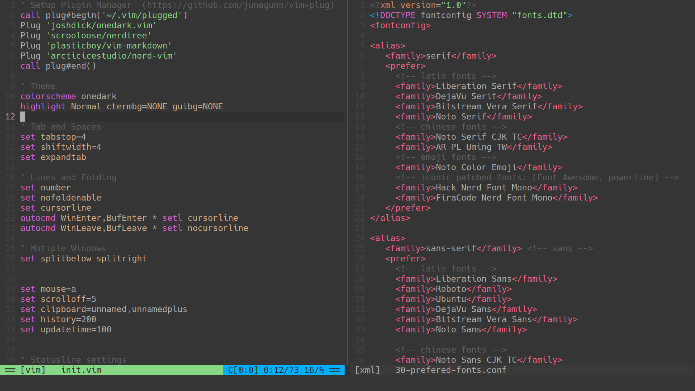
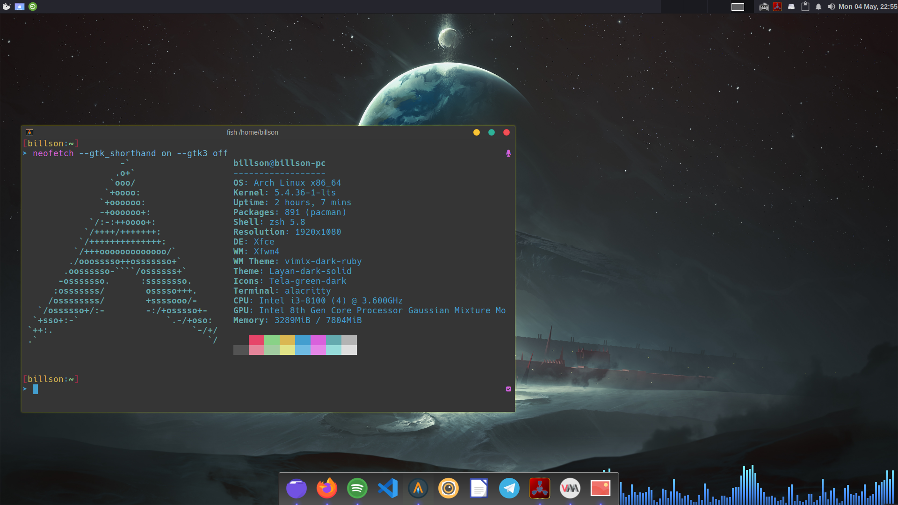
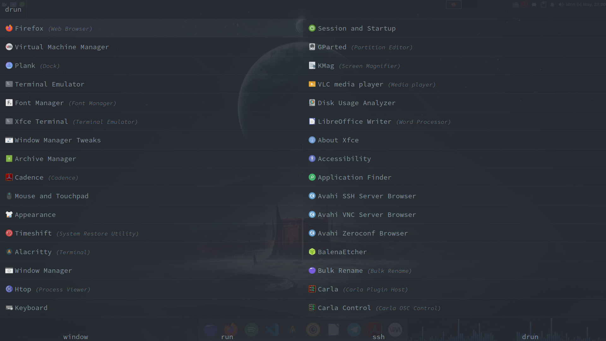

# Dotfiles

## Vim/Neovim

- In my opinion, neovim has better default settings than vim, see the [Documentation](https://neovim.io/doc/user/vim_diff.html#nvim-defaults) for more information.

- My config file is inspired by many others, here is the list

    - [Chrisatmachine's blog](https://www.chrisatmachine.com/Neovim/02-vim-general-settings/)
    - Makccr's [github repository](https://github.com/makccr/dot) and his [youtube video](https://www.youtube.com/watch?v=Kx-SDJwL01o)
    - xunil-cloud's [dotfiles](https://github.com/xunil-cloud/dotfiles)

## fish-shell

## Rofi

